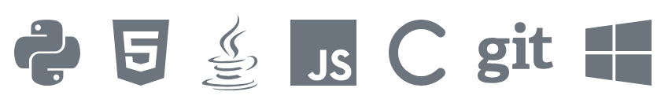

# Carlo E Sanchez
**Los Angeles, CA - [carloesanchez@gmail.com](mailto:carloesanchez@gmail.com)**

NASA Technical Lead & Software Engineer with 20 years of full stack development expertise, architecting 15+ cross-portfolio platforms, driving 30+ software products from DEV to PROD

More info @ **[cesanchez.io](https://cesanchez.io)**

*****

## Experience

### NASA - Jet Propulsion Laboratory

| May 2019 - Present | Technical Lead / Software Engineer |
|--------------------|-------------------------------------
|                    | What I'm currently working on.    Manage 16 different applications across all stages (DEV, UAT, PROD). Applications range from Java Thick Client software built on NetBeans Platform to Django Framework applications and dotNet Web applications.    Responsible for software deployments across several operating systems. These range from Windows Servers with web applications running on IIS with MSSQL Server backend to Docker container deployments on Linux with Django front end running on Nginx and MongoDB backend.    Heavy utilization of version control system is applied to maintain and document with GitLab repository running unit tests on GitLab Runners and processing other continuous integration deployments with Jenkins CI.    Utilize Jira and Confluence to maintain traceability of existing issues or bugs and up and coming projects that need to be addressed.    Spearheading effort to incorporate Cloudbased technologies such as AWS and Azure. Manage AWS environment that utilizes EC2 tenants and S3 buckets for our development infrastructure. These are managed via AWS CLI to take advantage of the IAC (Infrastructure as Code) methodology. |

### NASA - Jet Propulsion Laboratory

| October 2007 - May 2019 | Lead Software Engineer |
|--------------------|-------------------------------------
|                    | Contributions made during my time at this job.    Led the development effort for maintenace of a set of heavily utilized business applications adapted by JPL's business community. This included development and planning of maintenace and bug fix releases of Java applications developed on the NetBeans Framework.    Maintained development efforts for Perl Web CGI applications.    Administered MySQL/MariaDB and MongoDB Databases.    Administered JenkinsCI Servers for CI/CD processes required for build, test and deploy process. Was subject matter expert on CI/CD that contributed and assisted other teams adapting CI/CD methodologies into their projects.    Worked on projects that required Tableau data integration on AngularJS applications with Java REST APIs deployed to Oracle WebLogic Servers.    Developed Python and BASH programs to assist with backend technology automation and deployments. |

### NASA - Jet Propulsion Laboratory

| June 2005 - October 2007 | Enterprise Systems Analyst |
|--------------------|-------------------------------------
|                    | Worked perform during this period.    Provided expertise on implementation of a newly acquired Time Keeping application (Kronos). Performed data migrations from previous time keeping system. Wrote SQL queries, BASH scripts, Java programs to assist with migration, validations and maitenance of newly implemented software.    Was integral in developing a process that automated manual validations of weekly time keeping records with Java and JSP which were originally performed via a manual Excel procedure.    Helped automate weekly Payroll validation reports.|

### NASA - Jet Propulsion Laboratory

| December 2000 - June 2005 | Software Engineer |
|--------------------|-------------------------------------
|                    | Worked performed when I started at JPL.    Maintained automated Excel spreadsheets that relied heavily on Visual Basic. These automated Excel financial reports were converted to a Perl WebCGI program with MySQL DB backend.    Automated a paper centric report solution to an electronic PDF file distibution system that allowed for expiediency of financial reports distribution.    Built LAMP (Linux, Apached, MySQL, PHP) sites to facilitate custom reporting solutions needed for business partners. |

## Skills

### Programming Languages & Tools

#### Agile Development & Scrum, AWS, BASH, C++, Confluence, Git, Grunt, Gulp, HTML5, Java, JSON, JenkinsCI, Jira, Linux, NodeJS, NPM, .Net, MongoDB MySQL/MariaDB, Perl, Python, PowerShell SQL, Raspberry PI and Rust

## Interests

I enjoy being able to spend time with my family, jamming on guitar, bass or keyboards with my son, or just reading horror, fantasy and sci-fi books or movies of the same genre.

Being outdoors is my other passion ejoying activities like mountain biking, snowboarding, hiking, running or just being outside exploring in the woods.

Other pastimes and hobbies include cooking, tinkering with computers, learning new tech. I always like to keep engaged by teaching or learning, wether it's a new song to play, a new programming language or tech stack.

 

